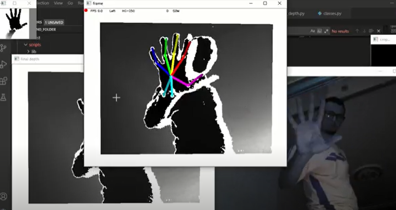
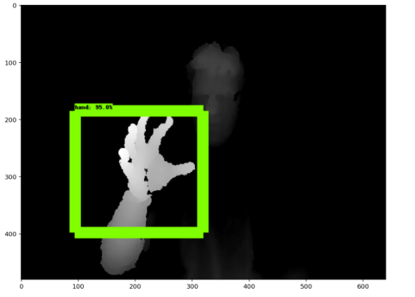

# 3D Hand Pose Estimation System



## Installation

Use the package manager [pip](https://pip.pypa.io/en/stable/) to install pipenv, a virtual environment tool

```bash
pip install pipenv
```
then install the requirements :
```bash
cd ............/django_project/django_project/

pip install -r requirements.txt
```
After that, we need to install [CUDA toolkit 10](https://developer.nvidia.com/cuda-10.0-download-archive)

finally, a depth sensor is required ! I'm using Orbbec Astra Mini with openNI sdk. You need to install the suitable driver.

## Usage

The libraries are integrated within a django project to use it as a backend to use it for an interactive projection solution, but you can use it separetly using the following commands :
```bash
cd ............/3D_hand_pose_system/
pipenv shell
cd django_project/
python handpose.py
```


Please download trained [weights](https://drive.google.com/drive/folders/1-Hk2XSuTzvUTrJ-WhluHmr8EWcuOSN9d?usp=sharing) to /django_project/Hand_pose_estimation_part/model
## Training :

### The Hand pose estimation model :

The model is based on the great work of Kuo Du and others : [Paper](https://openaccess.thecvf.com/content_CVPR_2019/papers/Du_CrossInfoNet_Multi-Task_Information_Sharing_Based_Hand_Pose_Estimation_CVPR_2019_paper.pdf) and [Code](https://github.com/dumyy/handpose). A great thanks for sharing their work with public.

For this project, the model is trained using [NYU dataset](https://drive.google.com/file/d/1I22UITfFPtDYLFRDFmZqc5BtpMU2zeU7/view?usp=sharing) (this version contains only the needed files, 4GB instead of 92GB) , please follow the instructions which I have provided in **the training notebook.**

### RGB-Depth hand detection model :
At first, we used a [pre-trained RGB based hand detector](https://github.com/victordibia/handtracking) but as the light emitted by the data show affected badly its performance, we managed to train another one using the depth sensor, details are in **the associated notebook.** 


## Contributing
Pull requests are welcome. For major changes, please open an issue first to discuss what you would like to change.

## References :
[CrossInfoNet: Multi-Task Information Sharing Based Hand Pose Estimation
Kuo Du1 Xiangbo Lin2* Yi Sun2 Xiaohong Ma2
Dalian University of Technology, China](https://openaccess.thecvf.com/content_CVPR_2019/papers/Du_CrossInfoNet_Multi-Task_Information_Sharing_Based_Hand_Pose_Estimation_CVPR_2019_paper.pdf) 


## License
[MIT](https://choosealicense.com/licenses/mit/)